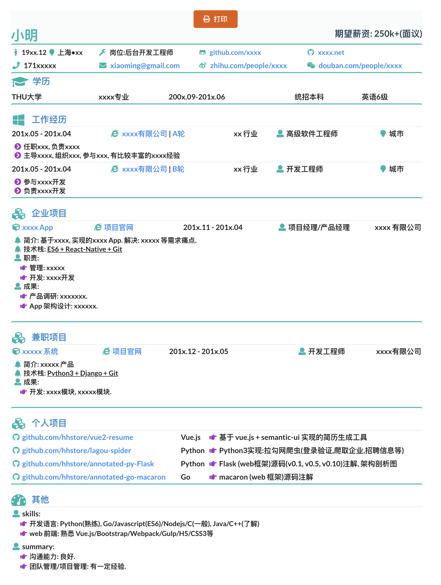

# vue2-resume

- 基于 vue2.js 和 semantic-ui 实现的 `简历` 生成工具.
- 简历修改:
  - 修改数据源: `/vue2-resume/src/assets/cv.json`
- 运行: `npm run dev`
- 打印: 调用浏览器自带打印功能
- 导出 PDF: chrome 的打印, 可导出 PDF.

## 简历打印预览图:



## Build Setup

``` bash
######################################################
#
# install dependencies
# 安装依赖:
#
npm install

######################################################
# 开发环境运行:
# serve with hot reload at localhost:8080
#
npm run dev

######################################################
#
# 生产环境运行:
#   - 此为编译结果, 需结合 HTTP 服务器才可访问
#
# build for production with minification
npm run build

######################################################
# build for production and view the bundle analyzer report
#
npm run build --report

# run unit tests
npm run unit

# run e2e tests
npm run e2e

# run all tests
npm test
```


For detailed explanation on how things work, checkout the [guide](http://vuejs-templates.github.io/webpack/) and [docs for vue-loader](http://vuejs.github.io/vue-loader).
