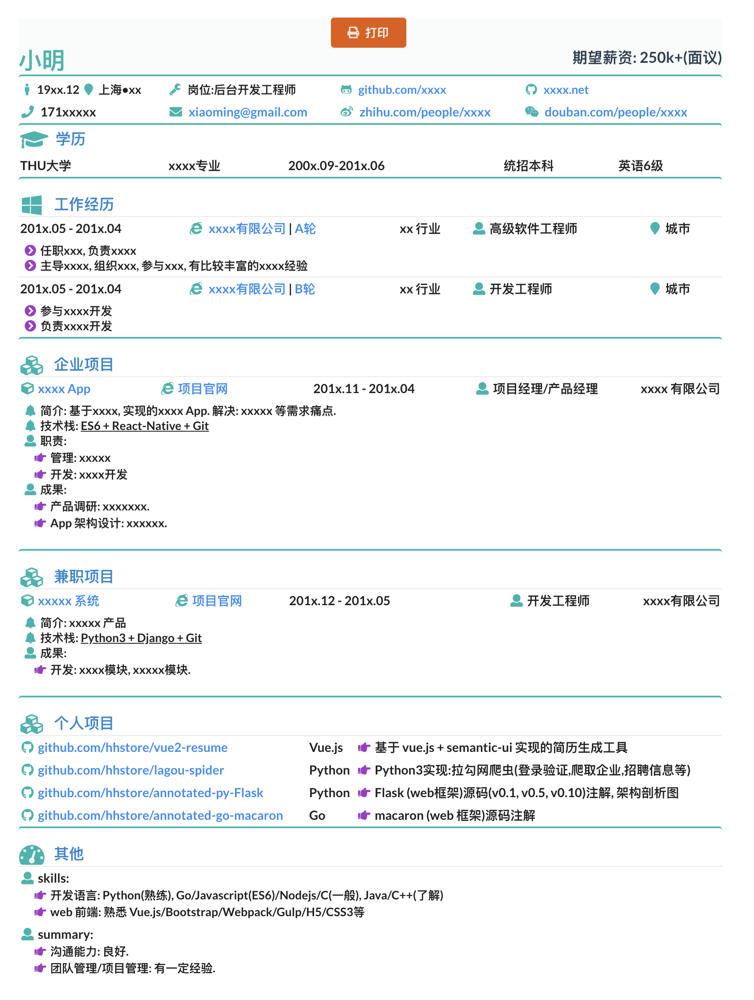

# vue-resume

## vue3-resume

- 项目: [vue3-resume](packages/vue3-resume/)
- ✅ 基于 Vue3 实现的简历生成器, 支持导出 PDF
- ✅ 重构 vue2-resume 的代码, 使其更符合 Vue3 的最佳实践

## vue2-resume

- 项目: [vue2-resume](packages/vue2-resume/)

- ✅ 基于 Vue2 实现的简历生成器, 支持导出 PDF

```ruby

# 安装依赖
task v2:install

# 启动项目
task v2:run

```

- ✅ 简历预览效果




## 项目结构

- npm workspaces: 使用 npm workspaces 管理多个子项目

```ruby
# 初始化工作区
npm init -w
bun init

```
